# 画像一覧

[進捗表](PROGRESS.md) / [元のプロンプト](../18_image-prompts.md)

generated/：生成したPNG原本。prompts/：生成時に使用したプロンプト。

## IMAGE-01 — Slide 12（重層下請構造）／Slide 13（仕事・カネ・責任の流れ）で再掲

[使用プロンプト](prompts/IMAGE-01.txt)

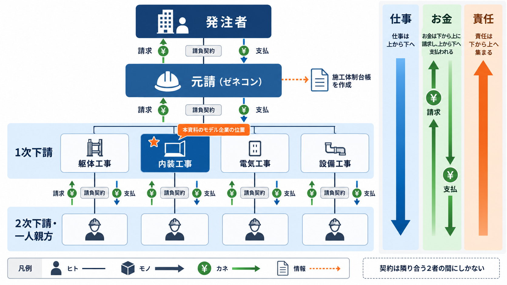

## IMAGE-02 — Slide 14（請負 ≠ 派遣）

[使用プロンプト](prompts/IMAGE-02.txt)

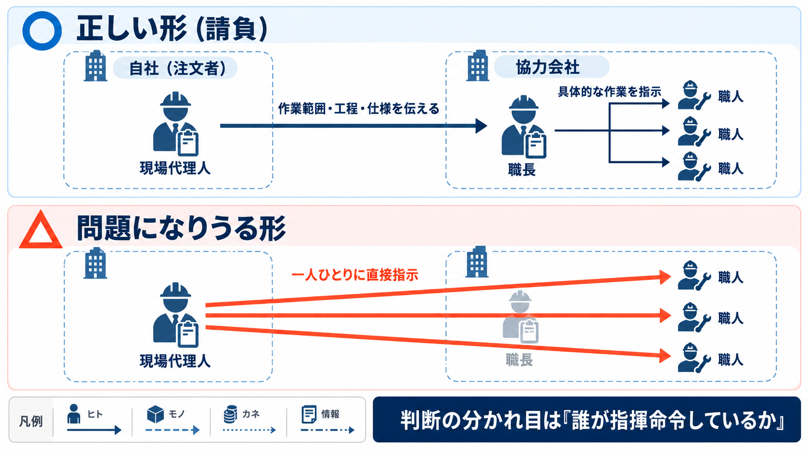

## IMAGE-03 — Slide 16（バリューチェーン）

[使用プロンプト](prompts/IMAGE-03.txt)

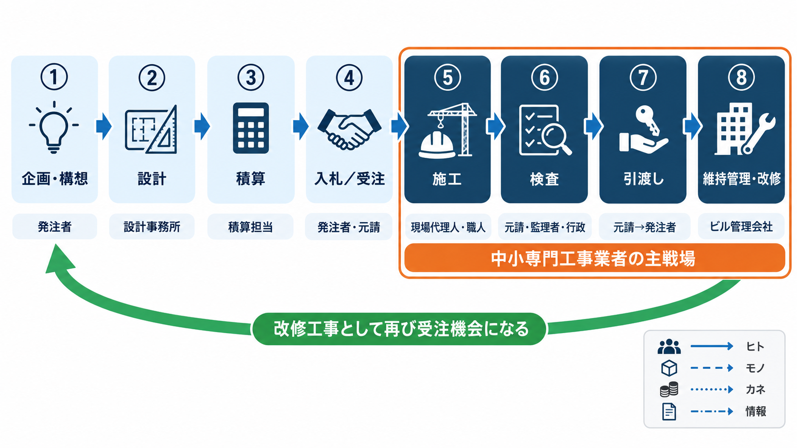

## IMAGE-04 — Slide 18（配置技術者）

[使用プロンプト](prompts/IMAGE-04.txt)

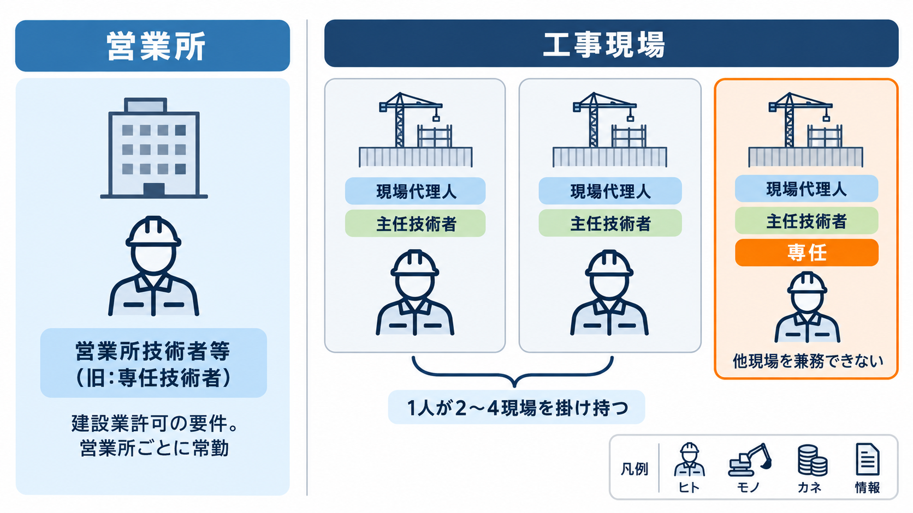

## IMAGE-05 — Slide 21（8つの機能マップ）

[使用プロンプト](prompts/IMAGE-05.txt)

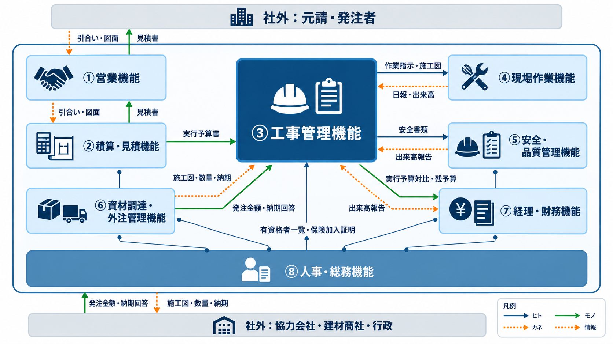

## IMAGE-06 — Slide 22（全社業務フロー S1〜S21）

[使用プロンプト](prompts/IMAGE-06.txt)

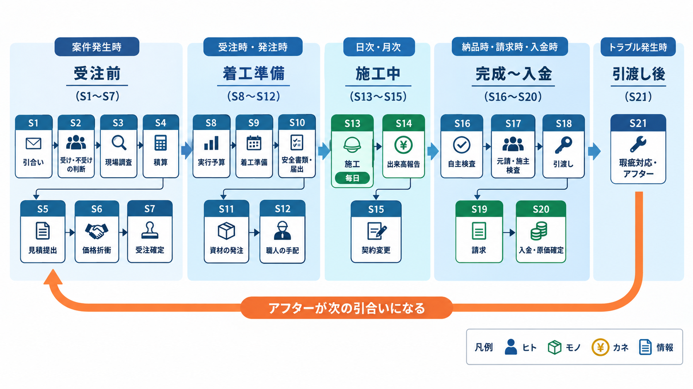

## IMAGE-07 — Slide 24（積算と実行予算）

[使用プロンプト](prompts/IMAGE-07.txt)

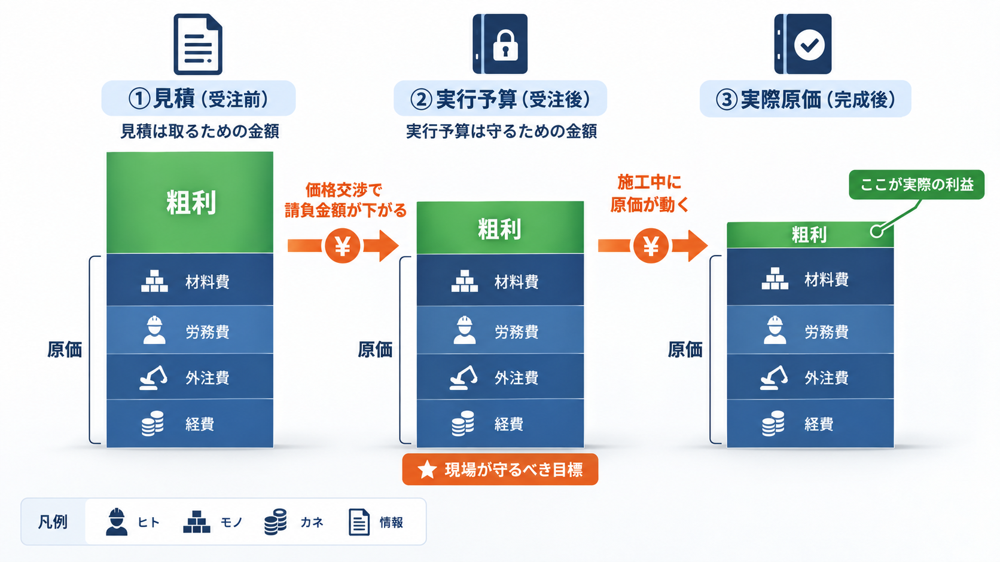

## IMAGE-08 — Slide 25（出来高払いとキャッシュの時間差）

[使用プロンプト](prompts/IMAGE-08.txt)

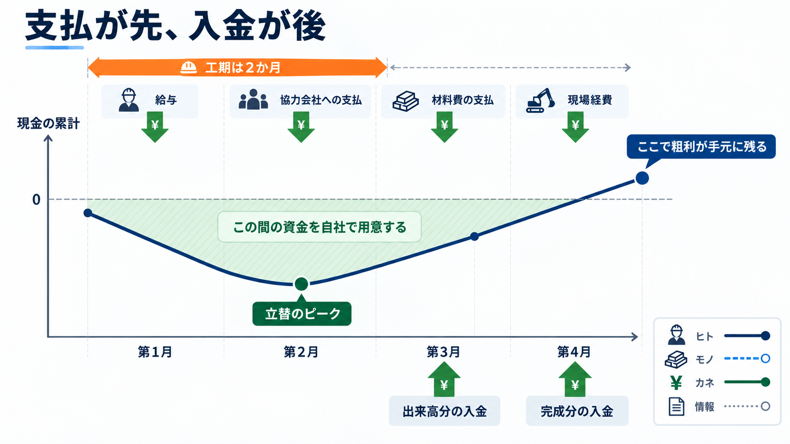

## IMAGE-09 — Slide 26（ヒトの流れ）

[使用プロンプト](prompts/IMAGE-09.txt)

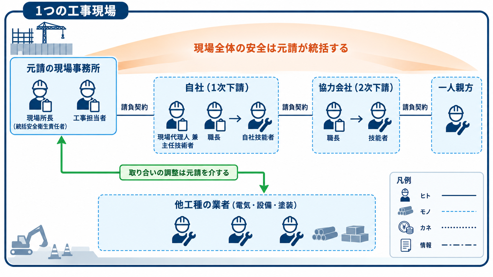

## IMAGE-10 — Slide 27（モノの流れ）

[使用プロンプト](prompts/IMAGE-10.txt)

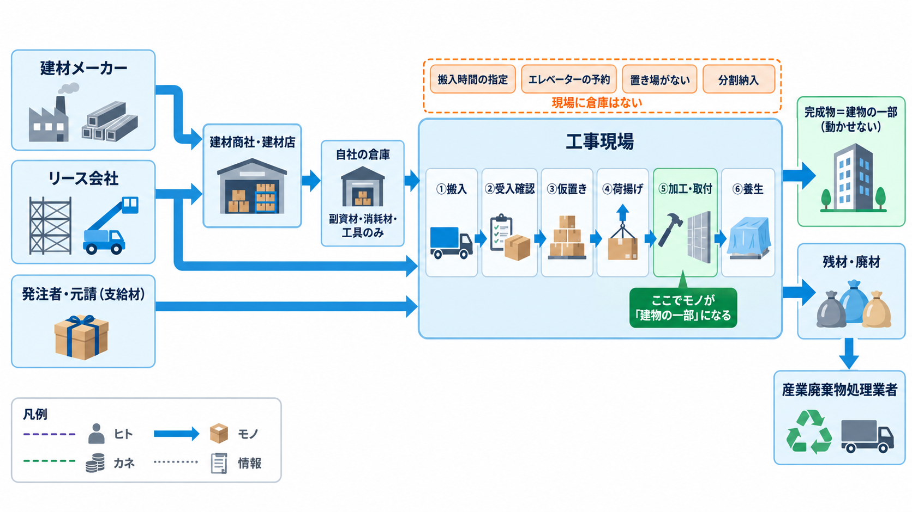

## IMAGE-11 — Slide 28（カネの流れ）

[使用プロンプト](prompts/IMAGE-11.txt)

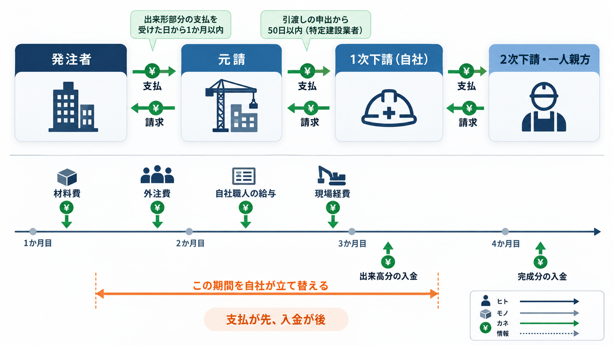

## IMAGE-12 — Slide 29（情報の流れ）

[使用プロンプト](prompts/IMAGE-12.txt)

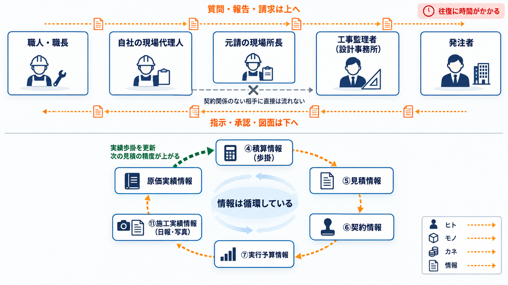

## IMAGE-13 — Slide 39（現場 ↔ 本社の連携）

[使用プロンプト](prompts/IMAGE-13.txt)

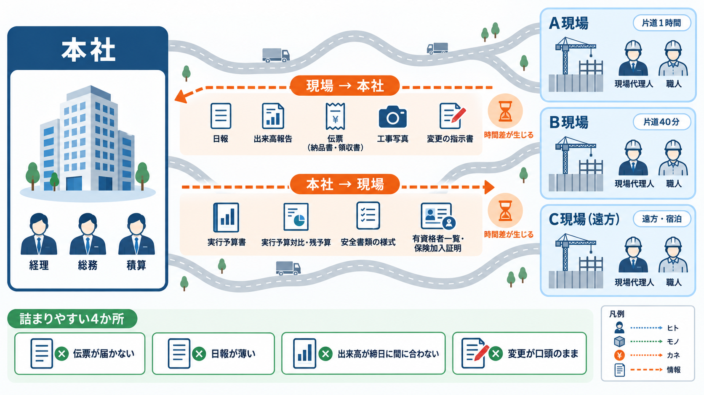

## IMAGE-14 — Slide 40（安全書類と施工体制台帳）

[使用プロンプト](prompts/IMAGE-14.txt)

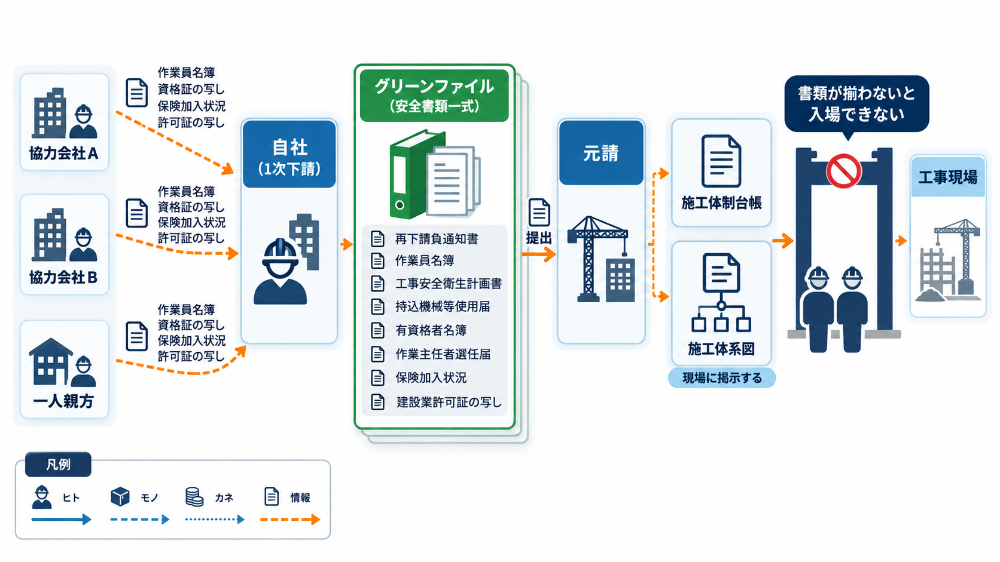

## IMAGE-15 — Slide 43（定期業務／3つの時間軸）

[使用プロンプト](prompts/IMAGE-15.txt)

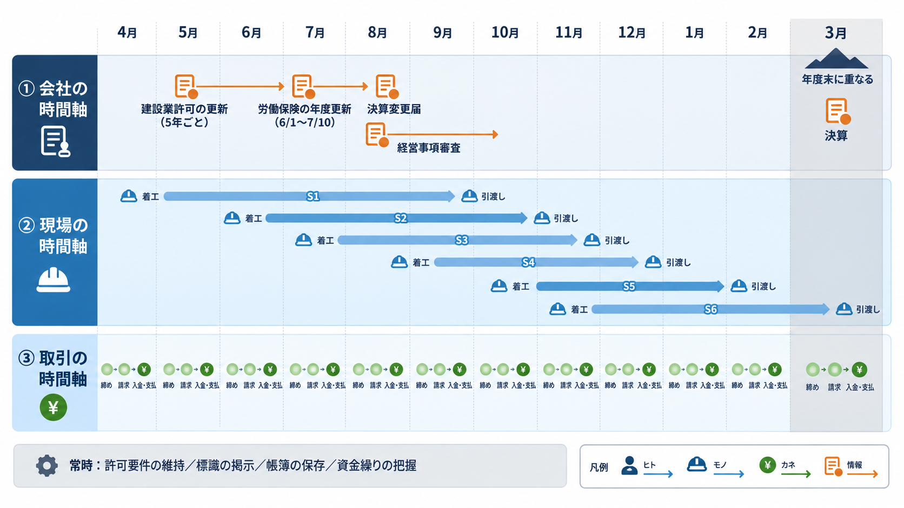
