# 画像一覧

[進捗表](PROGRESS.md) / [元のプロンプト](../18_image-prompts.md)

generated/：生成したPNG原本。prompts/：生成時に使用したプロンプト。

## IMAGE-01 — Slide 03：3分で分かる製造業

[使用プロンプト](prompts/IMAGE-01.txt)

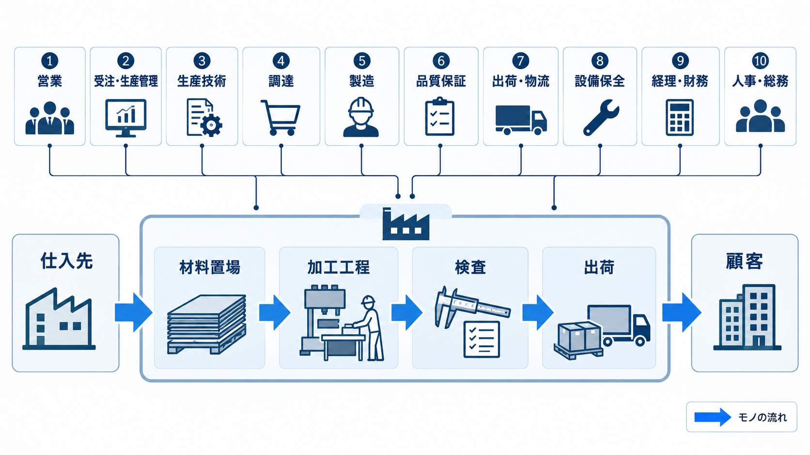

## IMAGE-02 — Slide 09：3つの生産形態が、すべての仕事の形を決める

[使用プロンプト](prompts/IMAGE-02.txt)

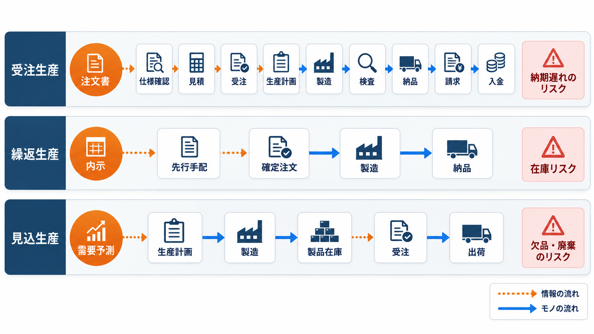

## IMAGE-03 — Slide 12：元請・下請の多重構造

[使用プロンプト](prompts/IMAGE-03.txt)

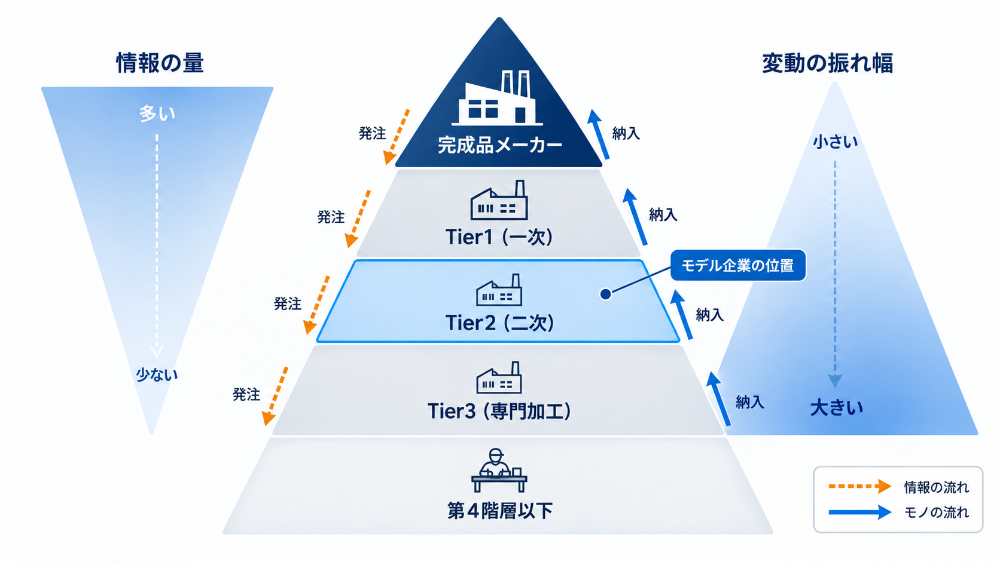

## IMAGE-04 — Slide 13：商流 — 誰から買って、誰に売るのか

[使用プロンプト](prompts/IMAGE-04.txt)

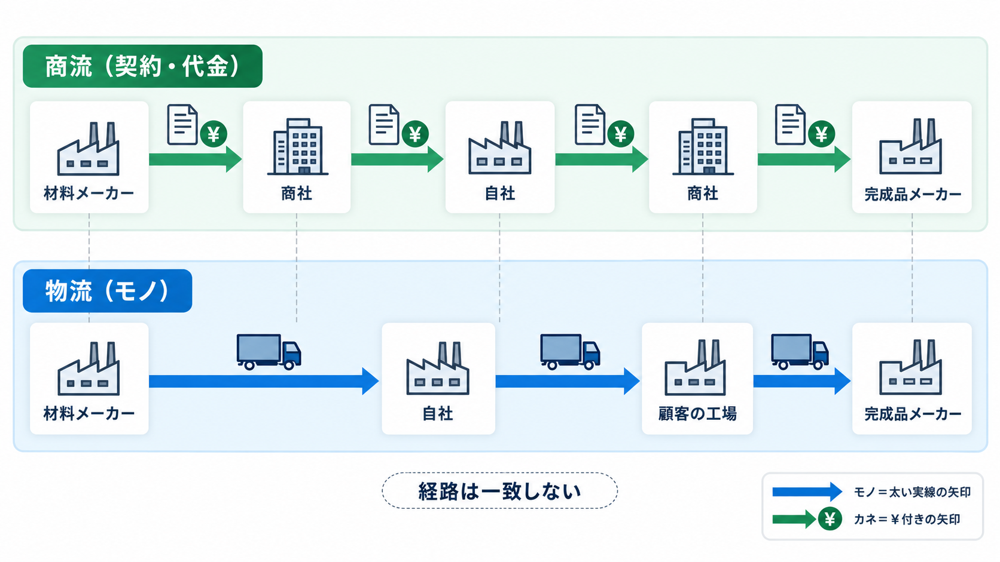

## IMAGE-05 — Slide 14：支給材 — 有償支給と無償支給

[使用プロンプト](prompts/IMAGE-05.txt)

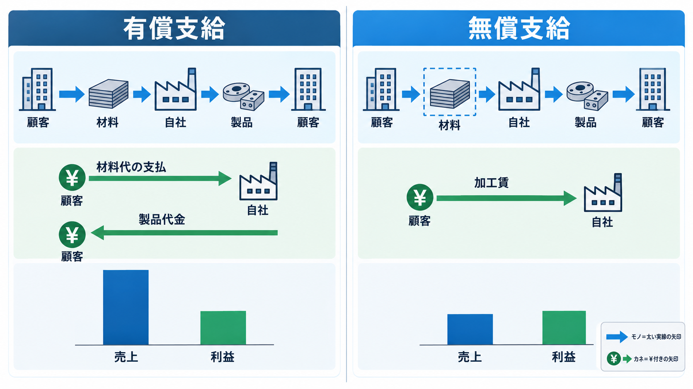

## IMAGE-06 — Slide 17：10機能の全体像 — 部署ではなく「機能」で見る

[使用プロンプト](prompts/IMAGE-06.txt)

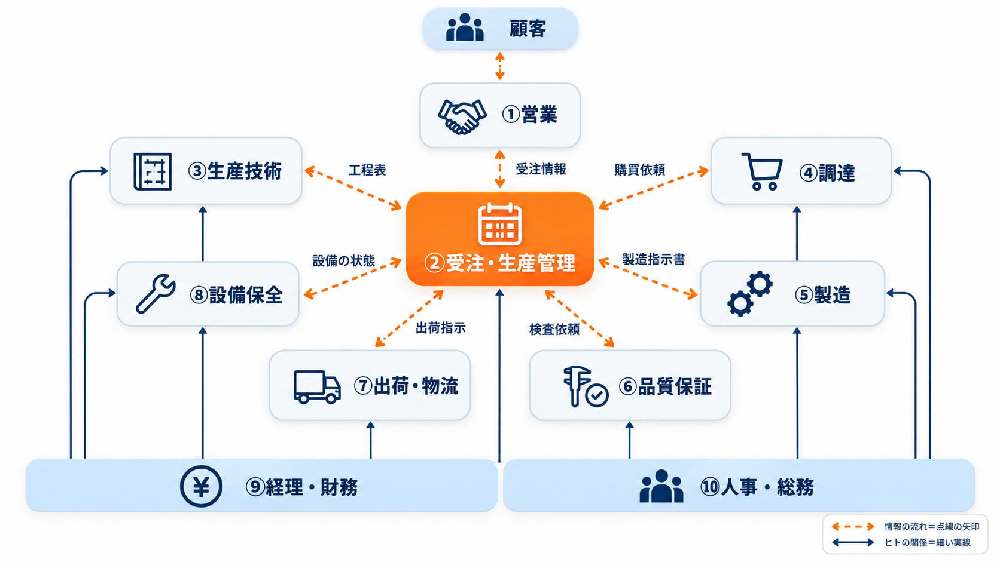

## IMAGE-07 — Slide 18：引合いから入金までの17ステップ

[使用プロンプト](prompts/IMAGE-07.txt)

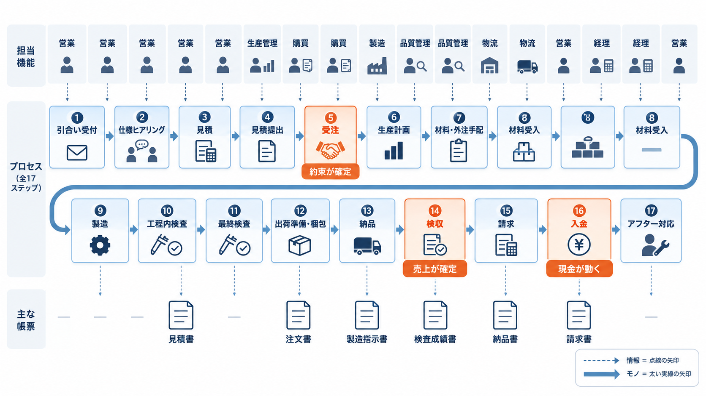

## IMAGE-08 — Slide 20：生産計画 — 「いつ作るか」を決める

[使用プロンプト](prompts/IMAGE-08.txt)

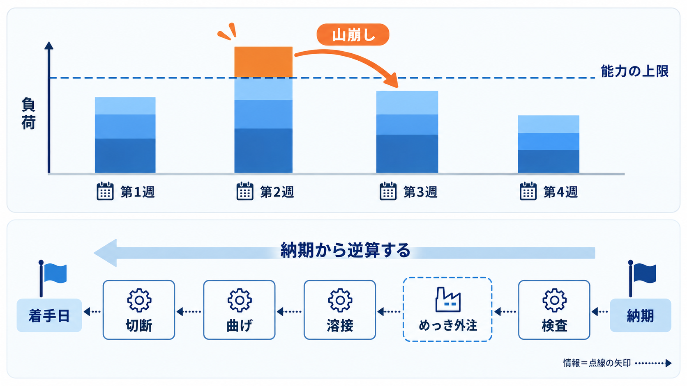

## IMAGE-09 — Slide 21：1件の注文を、最初から最後まで追う

[使用プロンプト](prompts/IMAGE-09.txt)

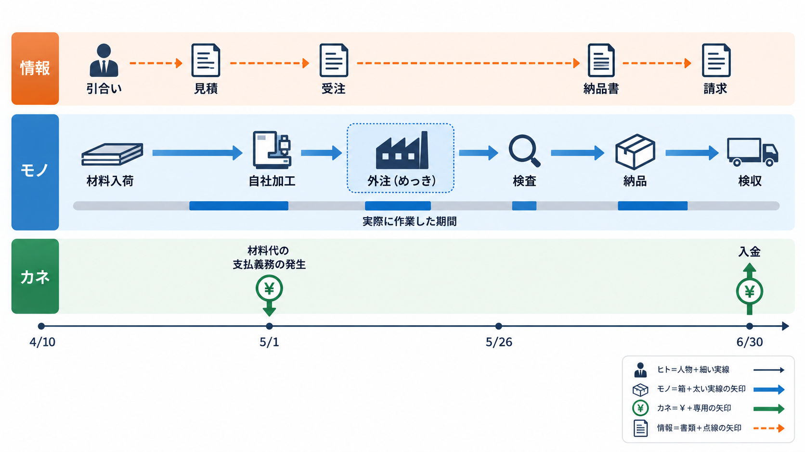

## IMAGE-10 — Slide 22：ヒトの流れ① — 誰が誰とつながっているか

[使用プロンプト](prompts/IMAGE-10.txt)

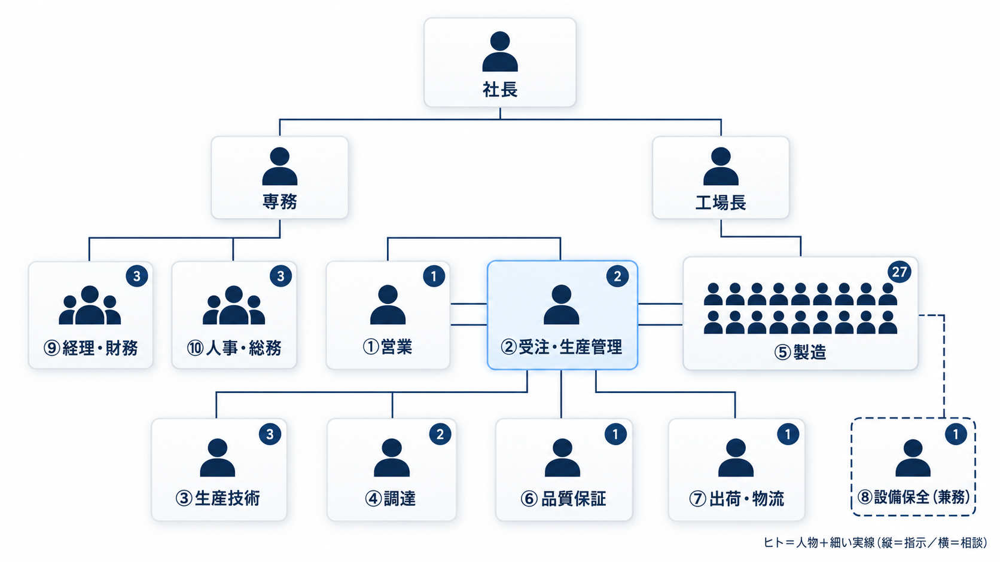

## IMAGE-11 — Slide 24：モノの流れ① — 工場の中を通り抜ける経路

[使用プロンプト](prompts/IMAGE-11.txt)

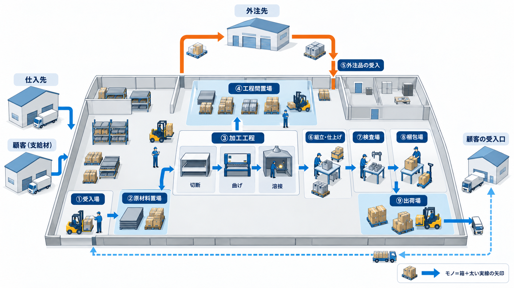

## IMAGE-12 — Slide 26：カネの流れ① — 出ていくお金と、入ってくるお金

[使用プロンプト](prompts/IMAGE-12.txt)

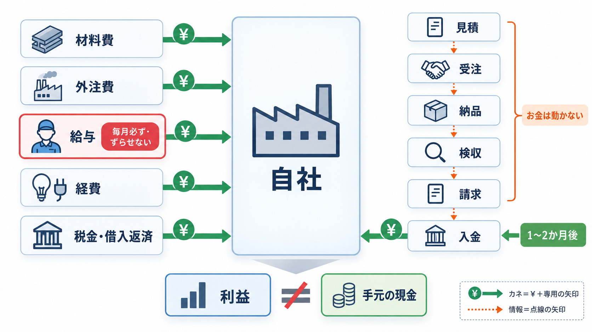

## IMAGE-13 — Slide 28：情報の流れ — 14の情報が連鎖する

[使用プロンプト](prompts/IMAGE-13.txt)

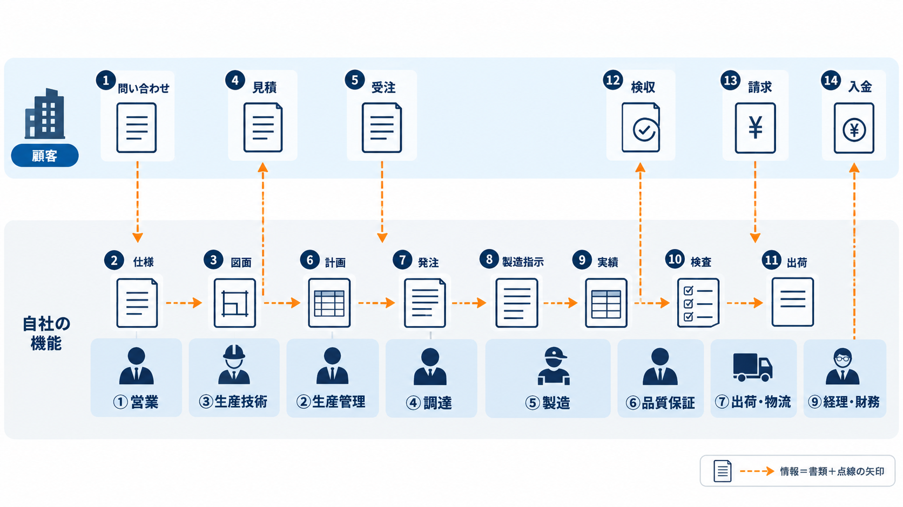

## IMAGE-14 — Slide 39：部署間連携 — 何が渡るのか

[使用プロンプト](prompts/IMAGE-14.txt)

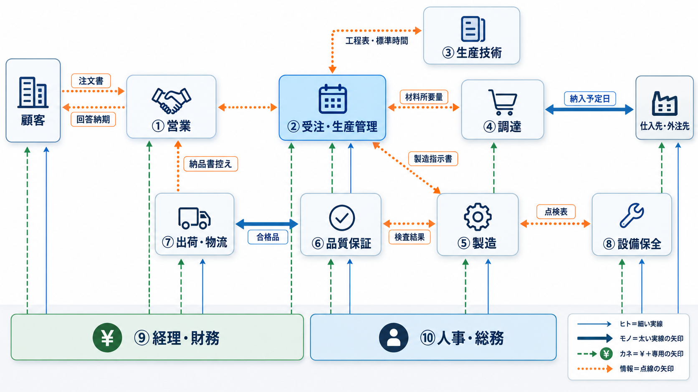

## IMAGE-15 — Slide 45：KPI② — 稼働率と可動率は、まったく別のもの

[使用プロンプト](prompts/IMAGE-15.txt)

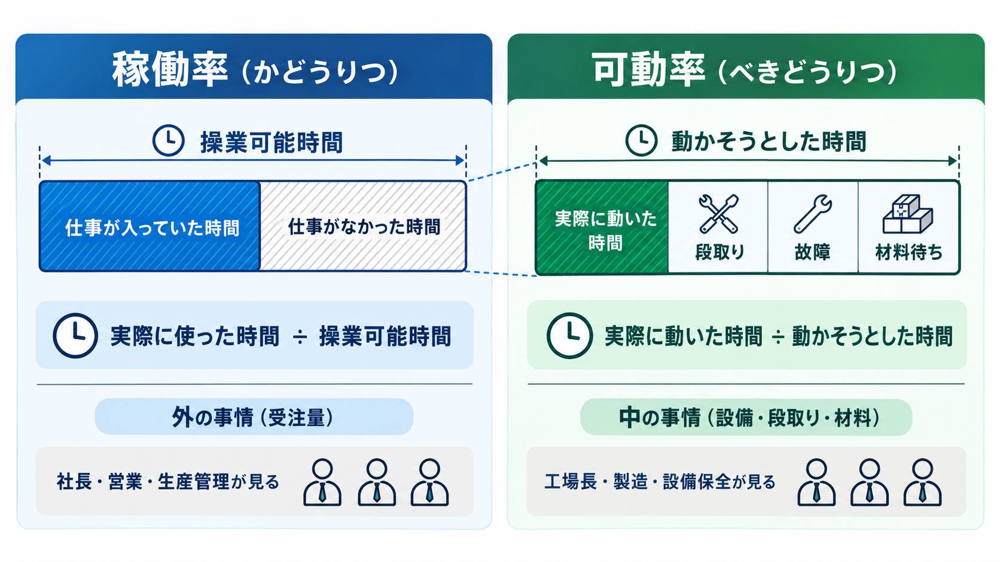
