# 画像一覧

[進捗表](PROGRESS.md) / [元のプロンプト](../18_image-prompts.md)

generated/：生成したPNG原本。prompts/：生成時に使用したプロンプト。

## IMAGE-01 — Slide 03：【まず最初に】小売業は他業界と逆

[使用プロンプト](prompts/IMAGE-01.txt)

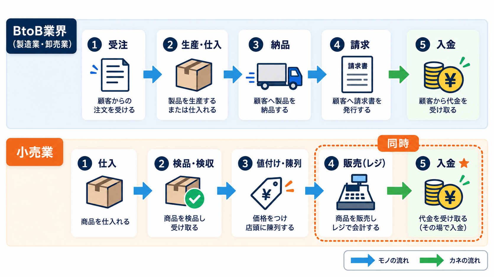

## IMAGE-02 — Slide 09：業界プレイヤーマップ

[使用プロンプト](prompts/IMAGE-02.txt)

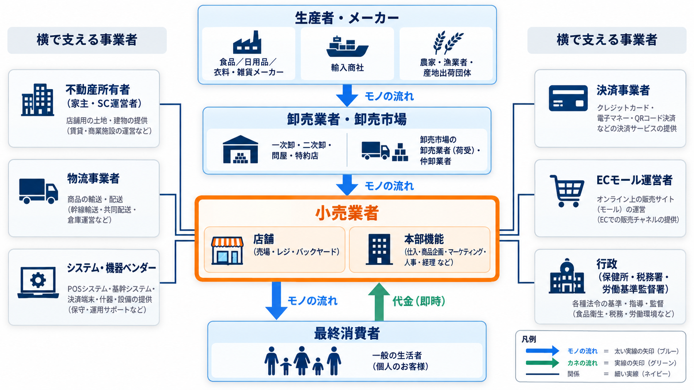

## IMAGE-03 — Slide 11：【最重要】買取仕入・委託仕入・消化仕入

[使用プロンプト](prompts/IMAGE-03.txt)

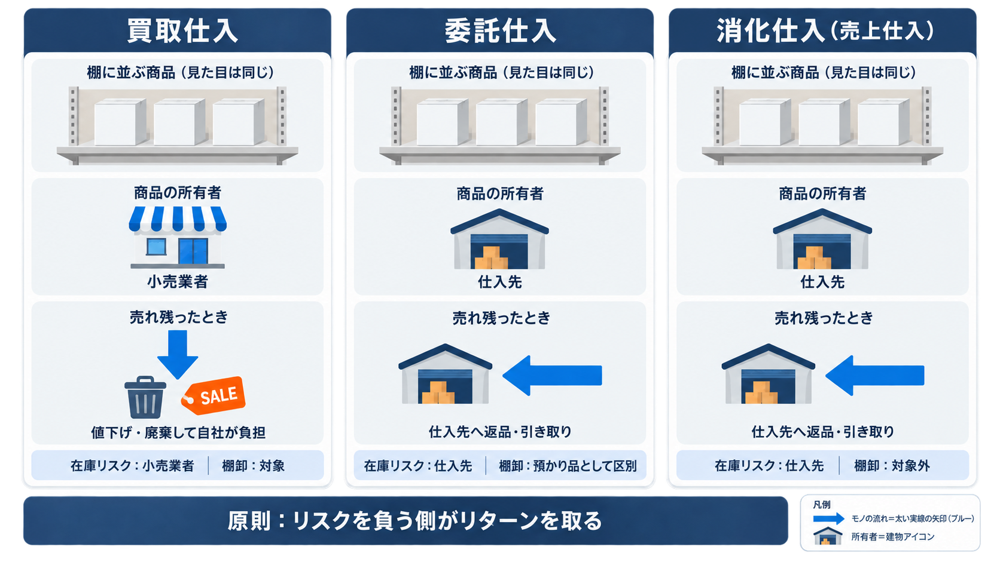

## IMAGE-04 — Slide 15：【二層構造】本部機能と店舗機能

[使用プロンプト](prompts/IMAGE-04.txt)

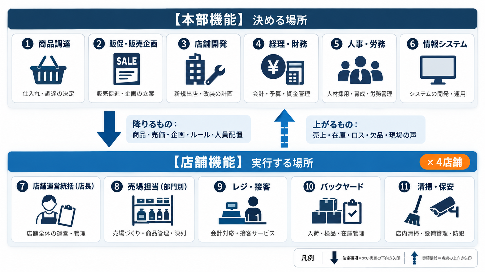

## IMAGE-05 — Slide 17：店舗の空間配置

[使用プロンプト](prompts/IMAGE-05.txt)

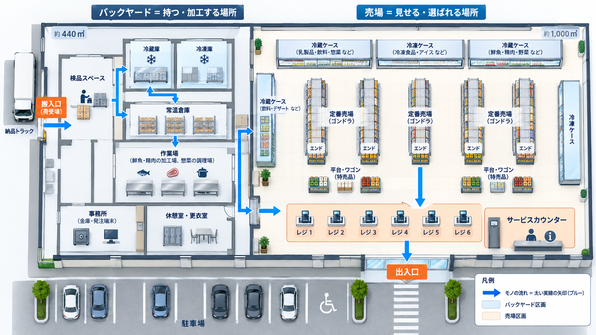

## IMAGE-06 — Slide 18：小売業では2つのサイクルが同時に走っている

[使用プロンプト](prompts/IMAGE-06.txt)

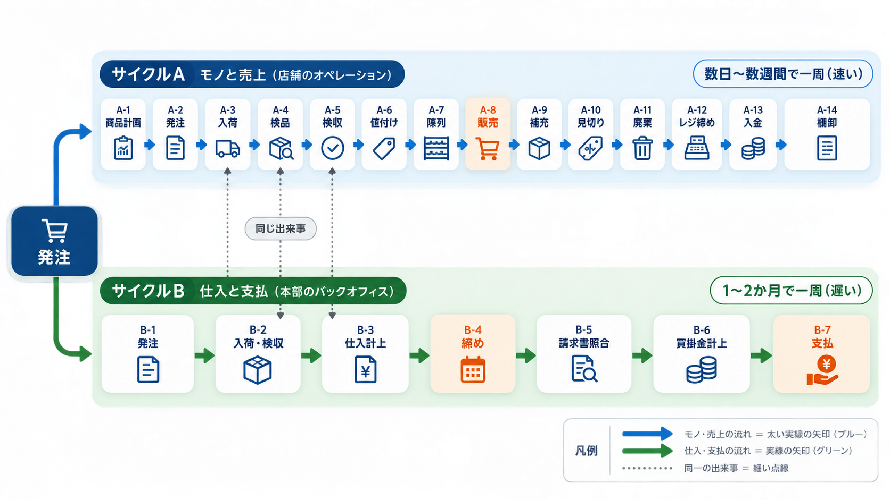

## IMAGE-07 — Slide 19：【サイクルA 前半】商品が店に入り、売れる状態になるまで

[使用プロンプト](prompts/IMAGE-07.txt)

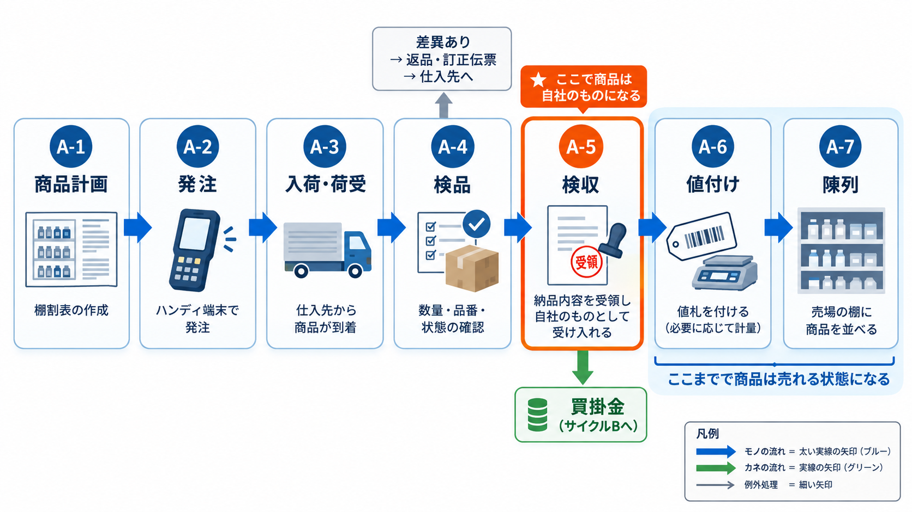

## IMAGE-08 — Slide 23：AとBの時間差 — 先に入って、後から出ていく

[使用プロンプト](prompts/IMAGE-08.txt)

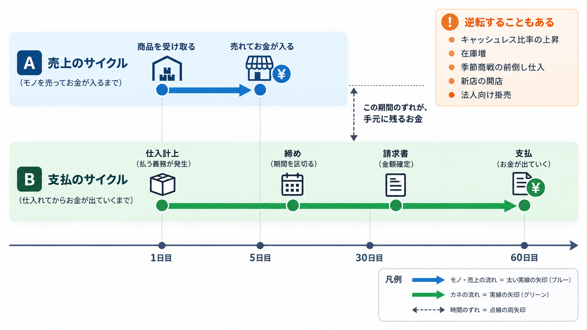

## IMAGE-09 — Slide 30：本部と店舗は何を受け渡しているか

[使用プロンプト](prompts/IMAGE-09.txt)

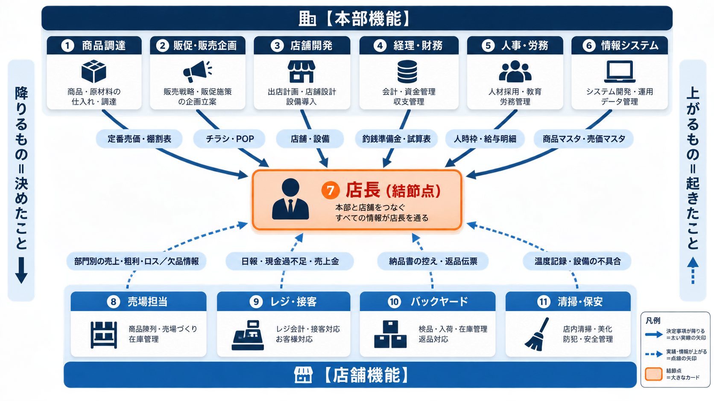

## IMAGE-10 — Slide 32：【ヒトの流れ】今日この店に誰がいるかが、毎日違う

[使用プロンプト](prompts/IMAGE-10.txt)

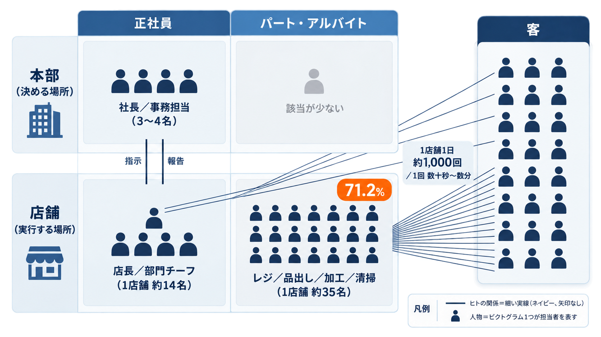

## IMAGE-11 — Slide 33：【モノの流れ】仕入先から消費者まで、または廃棄まで

[使用プロンプト](prompts/IMAGE-11.txt)

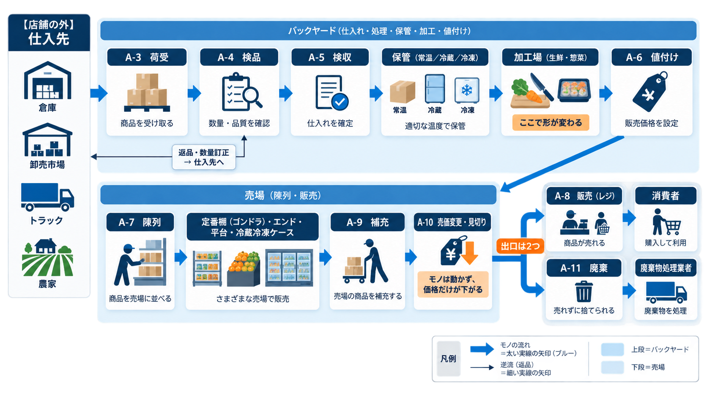

## IMAGE-12 — Slide 34：【カネの流れ】入りは消費者から、出は仕入先と人へ

[使用プロンプト](prompts/IMAGE-12.txt)

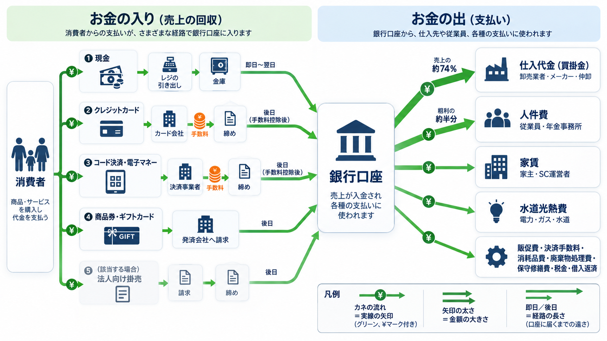

## IMAGE-13 — Slide 35：【情報の流れ】小売業の情報は一周して戻ってくる

[使用プロンプト](prompts/IMAGE-13.txt)

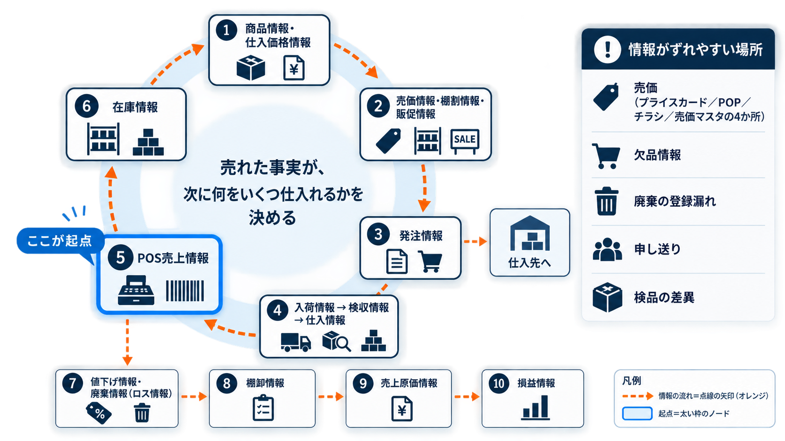

## IMAGE-14 — Slide 36：【最重要】値入 ≠ 粗利

[使用プロンプト](prompts/IMAGE-14.txt)

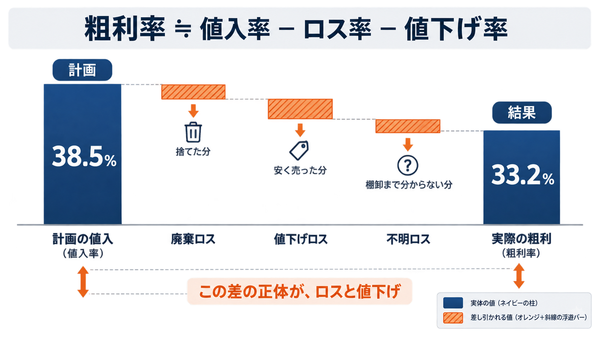
