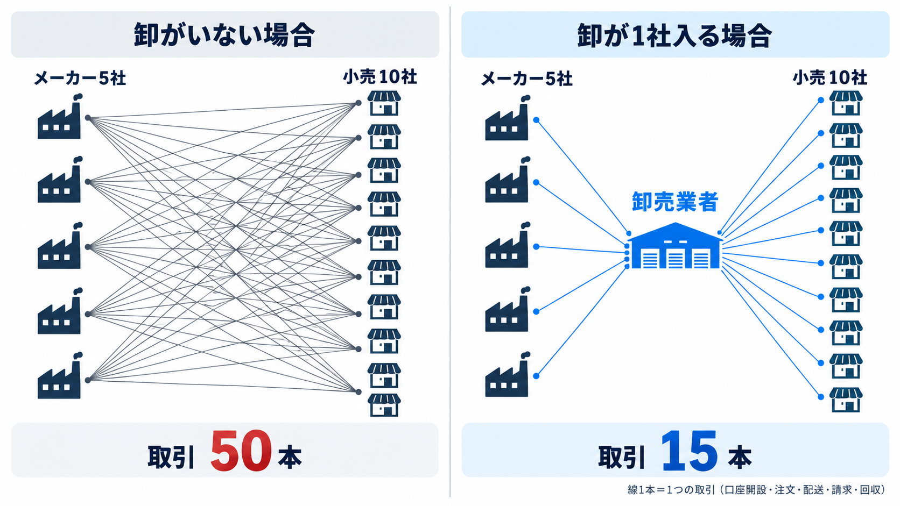
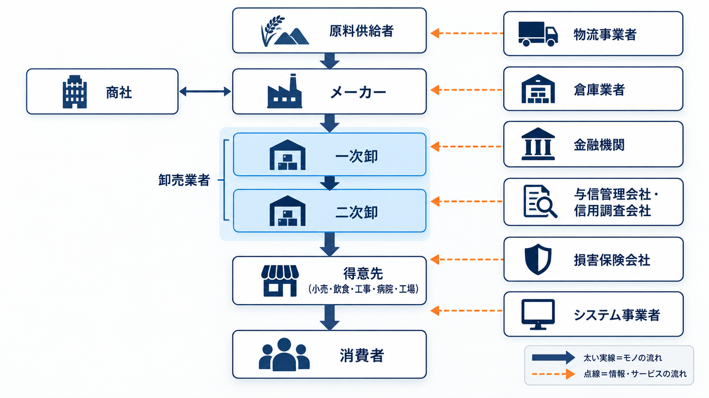
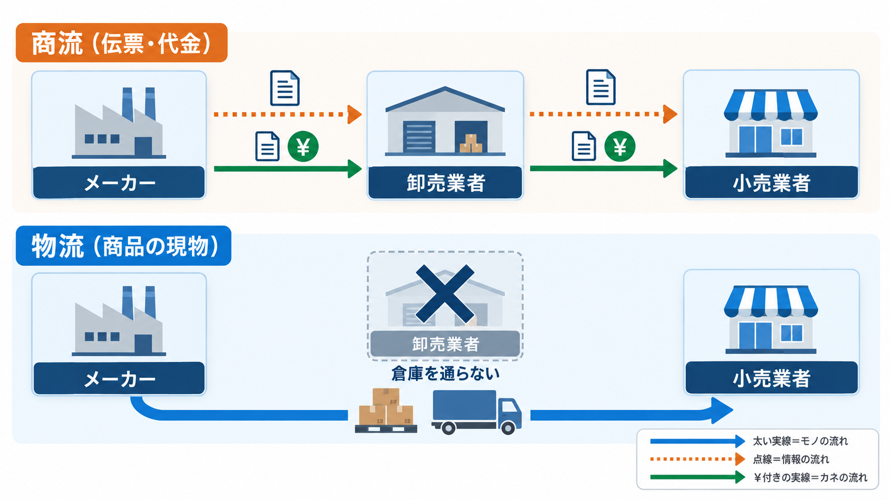
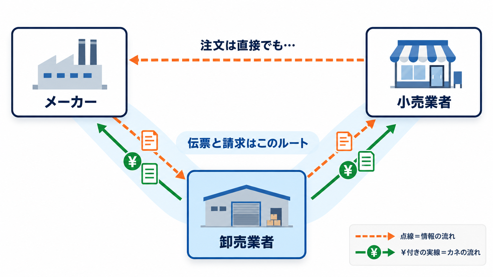
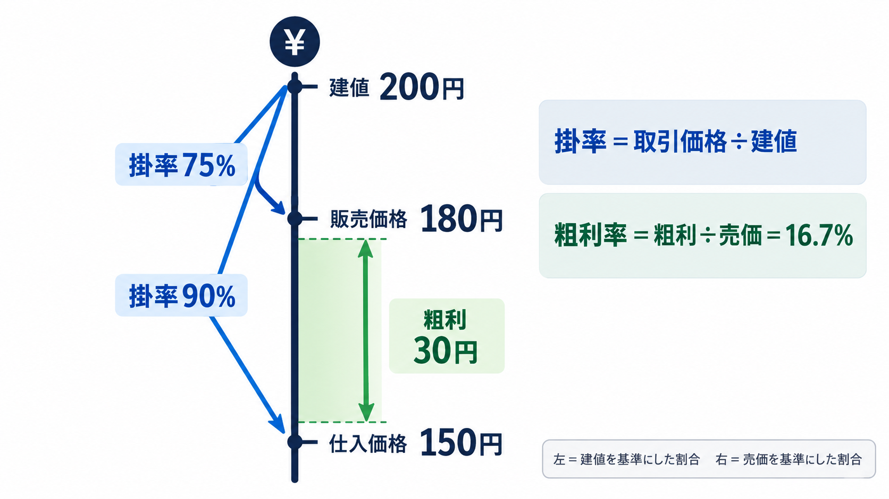
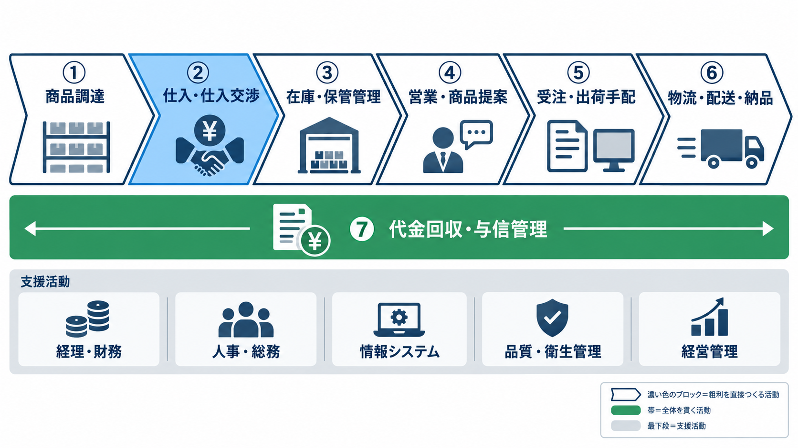
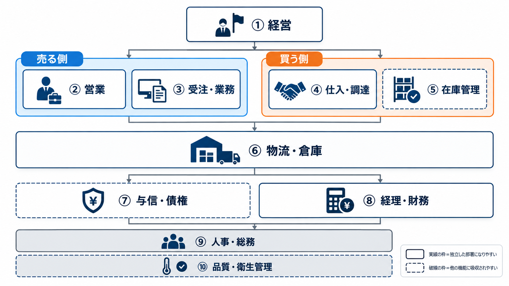
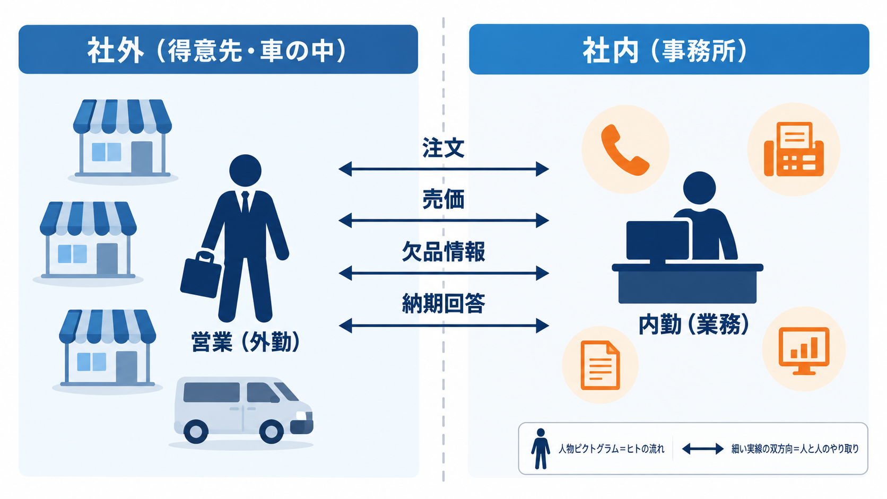
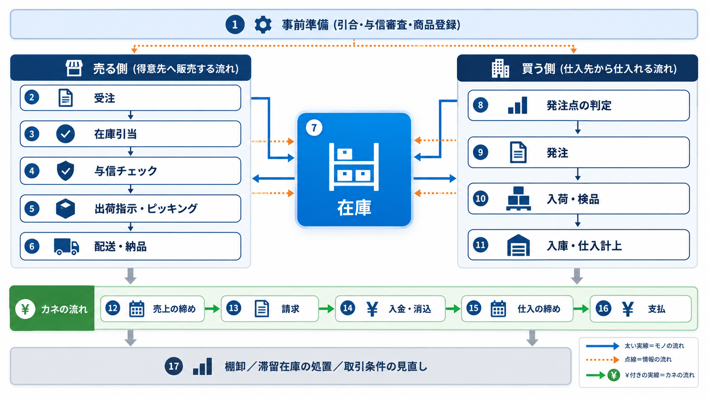
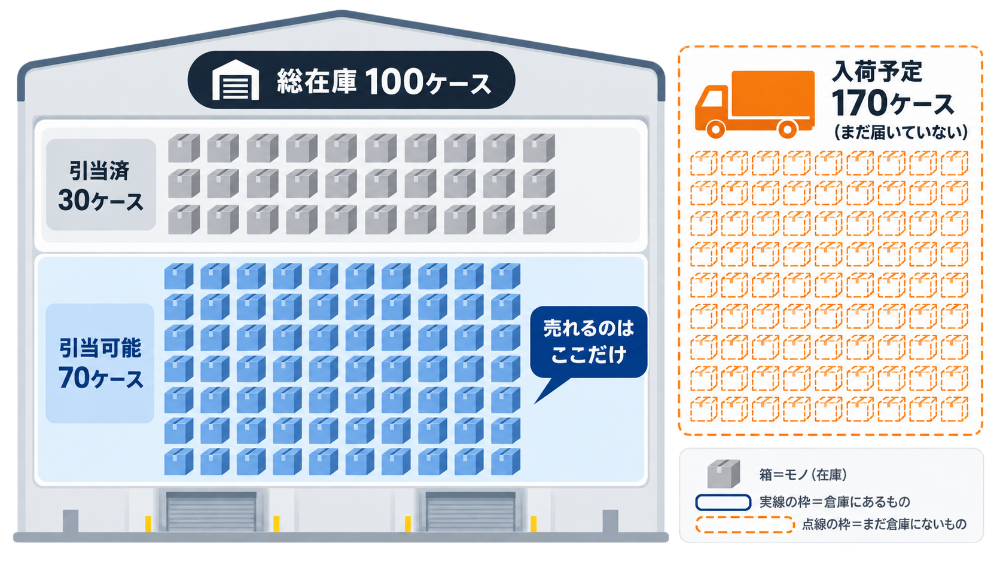

# 画像一覧

[進捗表](PROGRESS.md) / [元のプロンプト](../18_image-prompts.md)

generated/：生成したPNG原本。prompts/：生成時に使用したプロンプト。

## IMAGE-001 — Slide 7：取引総数最小化の原理

[使用プロンプト](prompts/IMAGE-001.txt)

## IMAGE-002 — Slide 10：業界プレイヤーマップ

[使用プロンプト](prompts/IMAGE-002.txt)

## IMAGE-003 — Slide 15：【最重要】商流と物流は一致しない

[使用プロンプト](prompts/IMAGE-003.txt)

## IMAGE-004 — Slide 17：帳合 ——取引ルートの取り決め

[使用プロンプト](prompts/IMAGE-004.txt)

## IMAGE-005 — Slide 18：建値・仕切価格・掛率

[使用プロンプト](prompts/IMAGE-005.txt)

## IMAGE-006 — Slide 20：卸売業のバリューチェーン

[使用プロンプト](prompts/IMAGE-006.txt)

## IMAGE-007 — Slide 22：卸売業の10の機能

[使用プロンプト](prompts/IMAGE-007.txt)

## IMAGE-008 — Slide 23：【最重要】営業（外勤）と内勤（業務）の分業

[使用プロンプト](prompts/IMAGE-008.txt)

## IMAGE-009 — Slide 26：全社業務フロー S0-1〜S28

[使用プロンプト](prompts/IMAGE-009.txt)

## IMAGE-010 — Slide 28：在庫引当 ——「売れる在庫」は総在庫ではない

[使用プロンプト](prompts/IMAGE-010.txt)

## IMAGE-011 — Slide 35：モノの流れ ——作らず、預かって、分けて、届ける

[使用プロンプト](prompts/IMAGE-011.txt)

## IMAGE-012 — Slide 36：カネの流れ ——「発生する時」と「動く時」は別

[使用プロンプト](prompts/IMAGE-012.txt)

## IMAGE-013 — Slide 37：情報の流れ ——同じ事実が、形を変えて流れていく

[使用プロンプト](prompts/IMAGE-013.txt)

## IMAGE-014 — Slide 38：部署間連携 ——前の機能のOUTが、次の機能のIN

[使用プロンプト](prompts/IMAGE-014.txt)

## IMAGE-015 — Slide 44：支払が先、入金が後 ——立て替えている構造

[使用プロンプト](prompts/IMAGE-015.txt)

